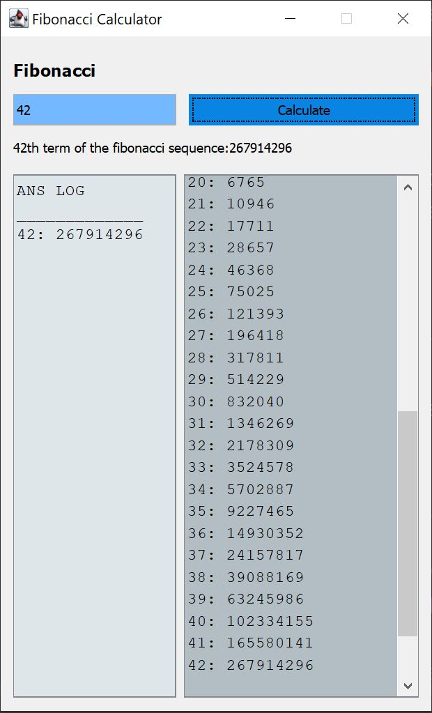

# fibonacci
Java calculator for the fibonacci sequence

This program calculates any term of the fibonacci sequence.
The input is the term number, such as the fifth term in the fibonacci sequence.
The output is the value of the term. 

To run this program, download the latest release from the [releases page](https://github.com/mrbrianevans/fibonacci/releases)

If you find any bugs or improvements to be made, please open an issue or pull request
